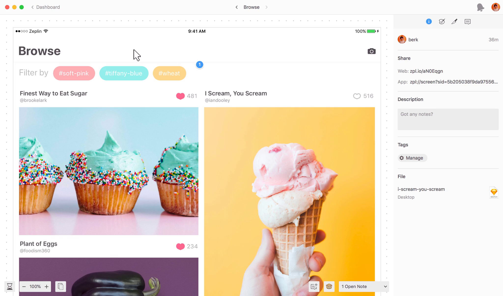
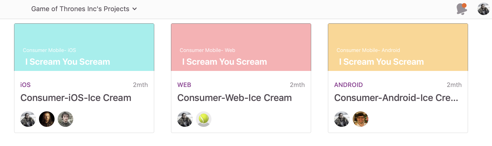

# Welcome to the Zeplin Onboarding Workbook!
We outline all the best practices and tips we've learned from the best teams, and share them here. You can copy/fork this repository to create a custom onboarding site for your team! Since it's in markdown, you can also simply copy and paste the content to other Wiki sites and it will work just fine too.

## Tips for Using This Template

*Purpose:* we list out best practices that we’ve seen teams adopt to effectively collaborate. It’s meant to help standardize your team’s workflow and facilitate onboarding team members.
*Customize:* this doc is a template and it’s meant to be customized based on your unique team setup and workflow. Feel free to take out any slides that are not applicable to your team.
*Engineers:* we recommend teams to review this with at least one engineering lead to agree on workflows and best practices you document on this onboarding doc.

 

 
 

## Getting Access to Zeplin

- Send request to: [fill in email], [fill in email]
- Create user account: https://app.zeplin.io/register 
- Download Zeplin macOS app: https://zpl.io/download-mac
- Access Zeplin Web app: https://app.zeplin.io

 
 

## Project Naming Convention

Once you start using Zeplin, it’s common to have hundreds of project. Establishing a naming convention enhances visibility of projects and discoverability.

*Naming:* use vocabulary that’s familiar to your team like team, group, platform, project, feature, epic name.
ex. Airbnb Experience-iOS-Check-out

*Thumbnail:* add a thumbnail to your project that makes it easy to distinguish platform type (Web, iOS, Android) or team.

### ex. Some teams color code thumbnails like this 👇

 
 

## Sharing Projects
Having a standard and clear way to share screens reduce unnecessary back and forth or any chances of miscommunication.

*Links:* use links to a specific set of screens using tags or sections

*Sharing:* choose a standard channel to share links like Slack, Github or Jira

 
 

## Slack Integration

*#channel:* create a channel in Slack and connect it to your specific Zeplin project. Channels can be based on features, team etc

*Notification settings:* on the Zeplin web app you can filter notifications. We recommend to enable only key notification types to prevent noise.

 
 

For more details see [GitHub Flavored Markdown](https://guides.github.com/features/mastering-markdown/).

*Jekyll Themes*
Your Pages site will use the layout and styles from the Jekyll theme you have selected in your [repository settings](https://github.com/patrickluvsoj/blog/settings). The name of this theme is saved in the Jekyll `_config.yml` configuration file.
