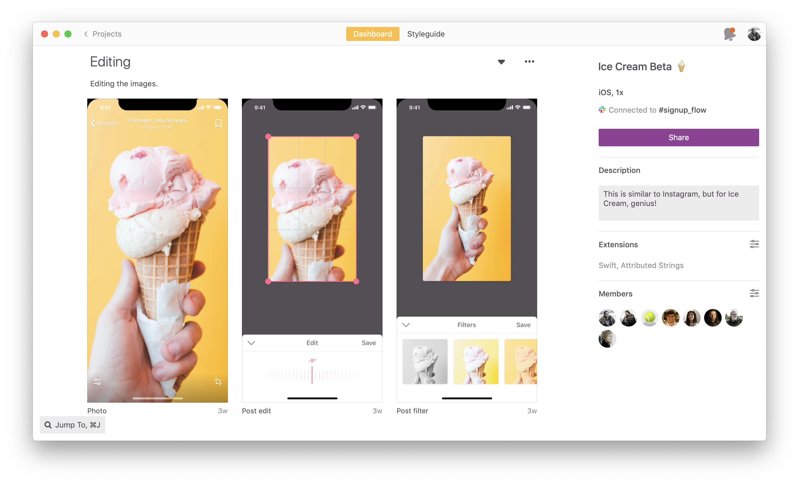
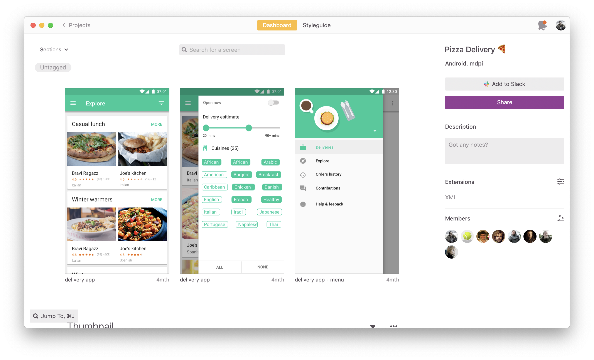
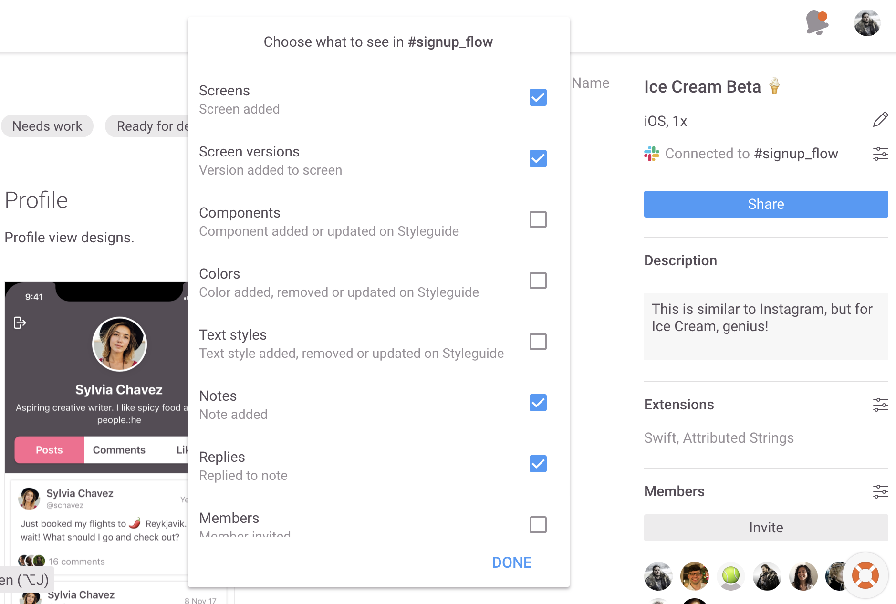

## Contents

### Organize 🧹
- Naming Projects
- Project Structure

### Collaborate 🤝
- Sharing Projects
- Notes
- Version History
- Slack Integration

### Develop 🖥 
- Assets
- Pop-out
- Components
- Extensions
- Prepare for hand-off

 
 

## Getting Access to Zeplin

- Send request to: [fill in email], [fill in email]
- Create user account: https://app.zeplin.io/register 
- Download Zeplin macOS app: https://zpl.io/download-mac
- Access Zeplin Web app: https://app.zeplin.io

 
 

## Project Naming Convention

### Guide
Once you start using Zeplin, it’s common to have hundreds of project. Establishing a naming convention enhances visibility of projects and discoverability.

*Naming:* use vocabulary that’s familiar to your team like team, group, platform, project, feature, epic name.
ex. Airbnb Experience-iOS-Check-out

*Thumbnail:* add a thumbnail to your project that makes it easy to distinguish platform type (Web, iOS, Android) or team.

**ex. Some teams color code thumbnails like this 👇**

### Your Content
**Naming Convention to be used at [your company] name:** ___________________________________

Example Project Name: ___________________________________________________

**Thumbnail:** add a thumbnail to your project that makes it easy to ____________________________

 
 

## Sharing Projects
Having a standard and clear way to share screens reduce unnecessary back and forth or any chances of miscommunication.

*Links:* use links to a specific set of screens using tags or sections

*Sharing:* choose a standard channel to share links like Slack, Github or Jira

 
 

## Slack Integration

*#channel:* create a channel in Slack and connect it to your specific Zeplin project. Channels can be based on features, team etc

*Notification settings:* on the Zeplin web app you can filter notifications. We recommend to enable only key notification types to prevent noise.

 
 

For more details see [GitHub Flavored Markdown](https://guides.github.com/features/mastering-markdown/).

*Jekyll Themes*
Your Pages site will use the layout and styles from the Jekyll theme you have selected in your [repository settings](https://github.com/patrickluvsoj/blog/settings). The name of this theme is saved in the Jekyll `_config.yml` configuration file.
